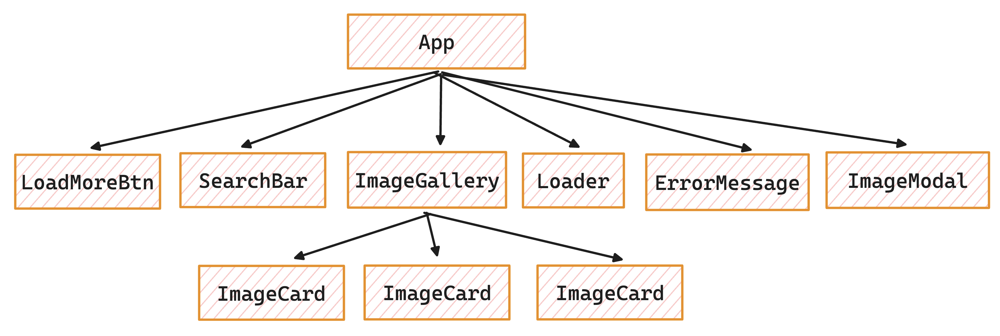

# 📁 A repository named `goit-react-hw-04` must be created.

- 🔗 In the homework submission, two links must be added: one to the source files and the other to the working link of the task page on [Vercel](https://vercel.com/).
- ⚡ The project must be created using [Vite](https://vite.dev/).
- 🚫 There should be no errors or warnings in the console when running the task code.
- 🏗️ For each component, a separate folder must be kept in the `src/components` folder, containing the React component's JSX file and style file. The folder name, component file name (with `.jsx` extension), and style file name (with `.module.css` before the extension) must be the same and compatible with the names specified in the task.
- 📤 Default export (`export default`) must be used when exporting components.
- 📡 The [axios](https://axios-http.com/) library must be used to perform HTTP requests.
- ✨ JavaScript code must be clean and understandable; Prettier must be used.
- 🎨 Styling must be done using CSS modules.

---

## 🔐 Environment Setup

Create a `.env` file in the project root and add your Unsplash API key:

```
VITE_UNSPLASH_ACCESS_KEY=your_access_key_here
```

Use `.env.example` as a template. Do not commit `.env` to GitHub.

---

## 🚀 GitHub Pages Deployment

This project is configured for GitHub Pages via GitHub Actions.

1. In `vite.config.js`, set `base` to `"/your-repo-name/"` (already set for this repo).
2. In GitHub, add a repository secret named `VITE_UNSPLASH_ACCESS_KEY`.
3. Go to `Settings` → `Pages` and select `GitHub Actions` as the source.
4. Push to `main` to trigger deployment.

---

## 🔍 Image Search

Develop an image search application with keywords. Watch the demo video showing how the application works.


---

## 🌐 Image Search Service

In this task, you need to get images from the [Unsplash](https://unsplash.com/developers) image service via HTTP requests.

- 🔑 Access documentation and the possibility of interacting with the backend by opening a developer account.
- 📝 Create a registration for your application in the service (New Application block). This is a mandatory step. Think of a name for your application, for example, "Image Gallery" or "Photo Search".
- 🔑 After creating the application registration, get the Access Key for HTTP requests in the `Keys` section on the application page.

#### ⚠️ Keep in mind that for Free (Demo) version applications, HTTP requests are limited to 50 per hour, do not make unnecessary requests!

Sections in the documentation that will be useful for you:

- 🔗 [How to create a request URL](https://unsplash.com/documentation#schema)
- 🔑 [How to add an access key](https://unsplash.com/documentation#public-authentication)
- 🔍 [Image search by keyword](https://unsplash.com/documentation#search-photos)

The response from the backend comes as an object containing all the necessary information. Inside this object, you will find an array of images and the total number of groups for pagination. Each image in the array is represented as an object containing a lot of information. Primarily, you will be interested in the links to images of different sizes within the `urls` property. Use the `small` version for gallery cards and the `regular` version for the modal window.

#### 💡 Do not stay limited to the task; use the data in the objects to show more interesting information in the modal window. For example, the author of the image, the number of likes, description, etc.

---

## 🧩 Components

In this task, you will need to determine the following components yourself and add basic styling to the interface. You can take the demo video of the application as an example.



---

## 📋 Search Bar Header

The `SearchBar` component takes a prop named `onSubmit` used to pass the input value received from the user when the form is submitted. The DOM structure created by the component is shown below:

```jsx
<header>
  <form>
    <input
      class="input"
      type="text"
      autocomplete="off"
      autofocus
      placeholder="Search images and photos"
    />
    <button type="submit">Search</button>
  </form>
</header>
```

When the user presses the submit button of the form, if the text field is empty, a notification should be shown stating that they need to enter text to search for images. This check will be performed inside the SearchBar component. Use the [React Hot Toast](https://react-hot-toast.com/) library for notifications.

## 🖼️ Image Gallery

The ImageGallery component creates a list of image cards with the following structure:

```jsx
<ul>
  {/* Set of list items with images */}
  <li>
    <div>
      
    </div>
  </li>
</ul>
```

The gallery should only be rendered when there are any loaded images. It is a good practice not to include the li element in the card component but to leave it as part of the gallery component.

## 🃏 Image Card

The ImageCard component is rendered in the gallery element. It creates a DOM element with the following structure:

```jsx
<div>
  
</div>
```

## ⏳ Loading Indicator

The `Loader` component is shown under the gallery while images are loading. You can use [react-loader-spinner](https://github.com/mhnpd/react-loader-spinner) or another ready-made component. While images are loading, the loading indicator should not replace the gallery, it should just be rendered under the gallery. This is critical when adding to existing images.

## ❌ Error Message

The ErrorMessage component is rendered instead of the image gallery in case of an HTTP request error. A simple text message will be enough.

## ➕ Load More Button

The `LoadMoreBtn` component creates a button with the text "Load More". When the button is clicked, the next set of images needs to be loaded and rendered together with the existing images.

- 🔘 The button should only be rendered when there are any loaded images.
- 🚫 If the image array is empty, the button is not rendered.

## 🪟 Modal Window

The `ImageModal` component should be rendered inside the `App` component and should receive all necessary data and functions from `App` as props.

When an image in the gallery is clicked, an `ImageModal` window with a dark background showing the image in large format should open. The modal window should be configured to close when the `ESC` key is pressed or when it is clicked outside. Use the [React Modal](https://github.com/reactjs/react-modal?tab=readme-ov-file#examples) library to implement the modal window functionality.
